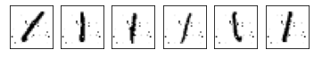

# Исследование атак на нейронные сети

Атаки на нейронные сети могут делиться на 2 типа:
* Отравление обучающих данных
* Состязательные атаки

**Отравление данных**

Суть атаки заключается в том, что на какую-то часть тренировочных данных определенного класса наносятся специальные маски, "триггеры", благодаря
которым модель переобучается, незаметно для валидации.

Все атаки такого типа должны быть обнаружены на этапе разведовательного анализа данных. Для того, чтобы проверить данные на корректность
можно посмотреть на качество кластеризации данных после уменьшения размерностей. Модели, используемые для уменьшения размерностей, такие как SVD, TSNE, PCA менее глубокие, чем
нейрнонные сети, используемые для кластеризации, поэтому они менее свойственны к переобучению и, скорее всего, просто проигнорируют триггеры. Данные, полученные после уменьшения размернстей
не будут содержать в себе шумы, и, если образцы, определившиеся в один кластер, будут размечены по разному - данные были неисправны. Попробуем нанести одинаковые маски-триггеры на некоторые картинки датасета MNIST, так
, чтобы например заставить модель классифицировать единицы с триггером, как шестерки. Для этого добавляем в датасет 1500 таких картинок, размеченных, как 6:

Обучим простенькую нейросеть с двумя слоями свёрток, дропаутом и двумя линейными слоями классифицировать цифры на отравленном датасете. Accuracy классификации единиц из исходного датасета, как единиц составила 0.965. Accuracy классификации отравленных единиц, как шестерок составила 0.941. То есть отравление данных работает. Попробуем найти в этих данных неточности на этапе препроцессинга.

Посмотрим на данные после уменьшения размерностей:

Видно, что достаточно чётко выявились кластеры разных цифр. Некоторые четвёрки смешались с девятками из-за похожести, некоторые пятёрки улетели к тройкам.

В отрпвленных данных данных часть шестёрок очень странно уехала к единицам, но не смешалась с ними, а образовала как-бы одинадцатый
кластер "отравленных" единиц. Этот график уже может навести на мысль об отравдении данных. 

Чтобы показать это все в цифрах, попробуем кластеризовать данные и сверить метрики исходных данных и отравленных.

В стобце указан метод уменьшения размерностей данных, в строках оцениваемые метрики. для кластеризации использовался базовый алгоритм KMeans.

Метрики кластеризации исходных данных:

Метрики отравленных данных:

Можно заметить, что при примерно равном коэффициенте силуэта (метрика, которая оценивает качество кластеризации, исходя
лишь из самих данных и того, как они кластеризовались), другие метрики, оценивающие сходство кластеризованных лейблов с исходными, при отравленных данных меньше, из-за
того, что разметку данных испортили при отравлении.
